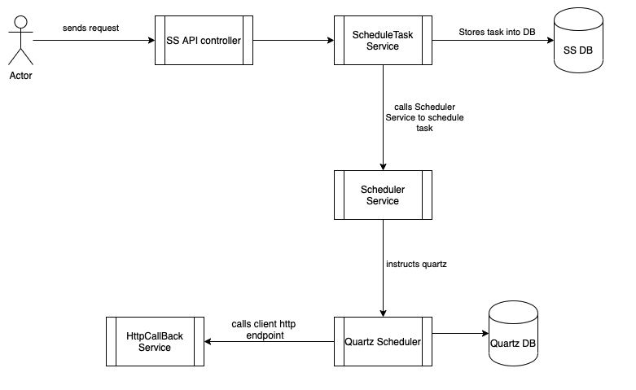
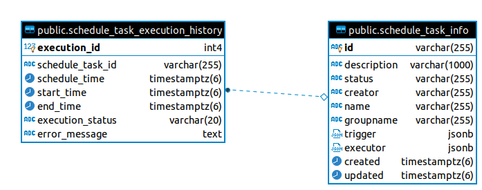

# Architecture

### Overview

SS provides an HA scheduler which clients can use for scheduling any http calls over a period of time. Internally, SS uses Quartz as a scheduler. SS runs Quartz as a clustered setup for HA. 
As of now only http calls are supported but in future support may be added for other communication protocols as well. 

### High Level
SS follows the conventional setup of spring boot based projects i.e. 

1. **Controller**: Exposes REST APIs
2. **Scheduler Service**: Provides and abstraction layer to interact with Quartz scheduler
3. **Schedule Task Service**: Provides implementation for all the REST APIs exposed by controller e.g. for create API, stores the task in DB and schedules it using Scheduler Service
4. **HttpCallBack Service**: Used by Scheduler Service to execute http calls to client end-point

* **Database**:  Postgres
* **Frameworks**: Spring boot, Quartz scheduler and hibernate 

### Database Schema

